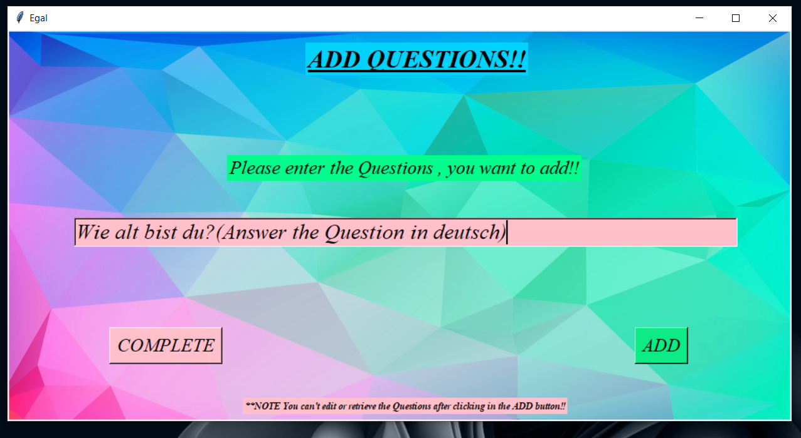

# Egal-Q_A
THIS SOFTWARE IS PARTICULLARLY DESIGNED FOR THOSE FELLOWS WHO LOVES TO TEST THEMSELVES ON A REGULAR BASIS.
' Egal-Q_A ' can help to fulfil their goals.

## Usage

- Open any editor like  VISUAL STUDIO CODE, run the above python code.


## Run Locally

Clone the project

```bash
  git clone https://github.com/manmay2/Egal-Q_A
```

Go to the project directory, run the main.py file on VS Code or IDLE python in 3.x version.

## Examples

- Guidelines for using the application <!--  -->
            <kbd></kbd>
            
- User can add Questions for self evaluation  <!--  -->
            <kbd></kbd>

- User can solve those Questions afterwards <!--  -->
            <kbd></kbd>
- User then have to review their Answers to be correct or incorrect <!--  -->
            <kbd></kbd>
- User will be shown the result and their overall percentage of the Self Assessment <!--  -->
            <kbd></kbd>            
           
**NOTE : PLEASE READ THE GUIDELINES OF USING THE SOFTWARE, WHICH WILL BE SHOWN AT THE VERY BEGINNING . **


## FUTURE SCOPE(to be added in future) :
 - I) ADDING THE TIME FUNCTIONALITY.(user can set the duration of their self evaluation)
 - II) UI IS TO BE UPDATED.
 
 
## License

[MIT](https://choosealicense.com/licenses/mit/)


## Authors

- [@Manmay Chakraborty](https://www.github.com/manmay2)


## Feedback

If you have any feedback, feel free to reach out at imanmay2@gmail.com


## Contributing

Contributions are always welcome!

Please feel free to contribute to this open source project

Please adhere to this project's `code of conduct`.
